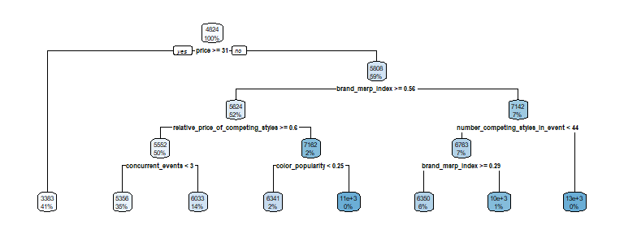

Case 7 - End-to-End Analytics at Rue La La (Part II)
================
Rawaha Nakhuda
March 12th, 2023

## Price Optimization

### 1. Linear Regression vs Regression Tree

1.  Train Test Split

``` r
prediction_data <- df[, 2:17]
set.seed(19) 
index <- createDataPartition(prediction_data$price, p = 0.8, list = FALSE)
train_data <- prediction_data[index, ]
test_data <- prediction_data[-index, ]
```

2.  Regression Trees

<div class="figure" style="text-align: center">


<p class="caption">
Regression Tree of Training Data
</p>

</div>

3.  Linear Regression

| term                | estimate |
|:--------------------|---------:|
| (Intercept)         |    12190 |
| price               |     -218 |
| beginning_of_season |       97 |
| weekend             |       34 |
| event_length        |      377 |
| morning             |     -627 |

Regression Model Coefficients

4.  MSE Comparison

| MSE Linear Regression | MSE Regression Tree |
|----------------------:|--------------------:|
|             2,685,391 |           2,366,873 |

MSE for Predicted Values

Conclusion:

The MSE for Regression Tree predictions is lower, and therefore performs
significantly better.

### 2. Optimal Price

$$
\begin{aligned}
\operatorname{Max} & \sum_{i \in N} \sum_{j \in M} p_j \widehat{D}_{i j k} x_{i j} \\
\text { s.t } \\
& \sum_{j \in M} x_{i j}=1 \quad \forall i \in N \\
& \sum_{i \in N} \sum_{j \in M} p_j x_{i j}=k \\
& x_{i j} \in\{0,1\}\\
\end{aligned}
$$

1.  Defining the list of prices

2.  Preparing variables

3.  Possible k values

4.  Initializing model

5.  Solving the model for Regression Trees

|     |     |     |     |     |     |     |     |     | Objectives |
|----:|----:|----:|----:|----:|----:|----:|----:|----:|-----------:|
|   1 |   0 |   0 |   1 |   0 |   0 |   1 |   0 |   0 |    426,569 |
|   1 |   0 |   0 |   0 |   1 |   0 |   1 |   0 |   0 |    458,319 |
|   0 |   1 |   0 |   0 |   1 |   0 |   1 |   0 |   0 |    485,101 |
|   0 |   1 |   0 |   0 |   1 |   0 |   0 |   1 |   0 |    511,882 |
|   0 |   0 |   1 |   0 |   1 |   0 |   0 |   1 |   0 |    469,608 |
|   0 |   0 |   1 |   0 |   1 |   0 |   0 |   0 |   1 |    427,333 |
|   0 |   0 |   1 |   0 |   0 |   1 |   0 |   0 |   1 |    355,242 |

Optimal Price Solutions for Regression Tree

6.  Initializing model for Linear Regression

7.  Solving the model for Linear Regression

|     |     |     |     |     |     |     |     |     | Objectives |
|----:|----:|----:|----:|----:|----:|----:|----:|----:|-----------:|
|   1 |   0 |   0 |   1 |   0 |   0 |   1 |   0 |   0 |    506,025 |
|   0 |   1 |   0 |   1 |   0 |   0 |   1 |   0 |   0 |    507,037 |
|   0 |   1 |   0 |   0 |   1 |   0 |   1 |   0 |   0 |    508,058 |
|   0 |   1 |   0 |   0 |   1 |   0 |   0 |   1 |   0 |    509,117 |
|   0 |   0 |   1 |   0 |   1 |   0 |   0 |   1 |   0 |    499,314 |
|   0 |   0 |   1 |   0 |   0 |   1 |   0 |   1 |   0 |    489,424 |
|   0 |   0 |   1 |   0 |   0 |   1 |   0 |   0 |   1 |    479,504 |

Optimal Price Solutions for Linear Regression Model

Conclusion:

The optimal price is not changing between the two models. However since
the predicted demand is different, the revenue is maximized for the
linear regression model.

### 3. Optimal Prices with Assumptions

Constraints:  
1. Items B & C cannot be sold for \$35  
2. Item A cannot be sold for \$25

1.  Defining the list of prices

2.  Preparing variables

3.  Possible k values

4.  Initializing model

5.  Solving the model for Regression Trees with the assumptions

|     |     |     |     |     |     | Objectives2 |
|----:|----:|----:|----:|----:|----:|------------:|
|   1 |   0 |   0 |   1 |   1 |   0 |     485,101 |
|   1 |   0 |   0 |   1 |   0 |   1 |     511,882 |
|   0 |   1 |   0 |   1 |   0 |   1 |     469,608 |
|   1 |   0 |   1 |   0 |   0 |   1 |     480,131 |

Optimal Price Solutions for Regression Tree with Constraints

Conclusion:

The objective value is equal to 511,882.
