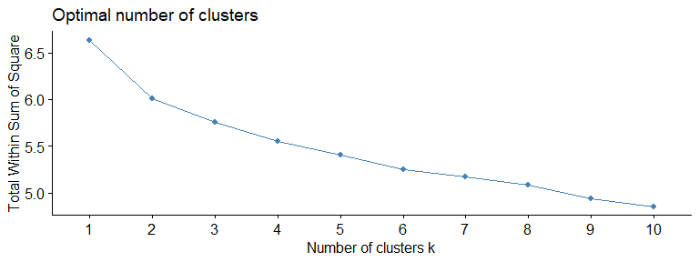
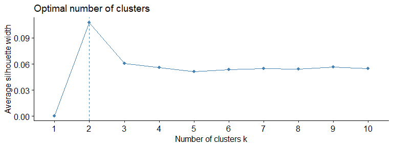
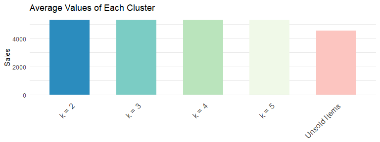

Case 7 - End-to-End Analytics at Rue La La (Part I)
================
Rawaha Nakhuda
March 5th, 2023

# Assignment 6

## Demand Estimation

### 1. Difference between Total Sales and Demand

In the context of the case:

- Total sales refers to the total items sold of a specific item in an
  event
- Demand is the prediction of how much the item is expected to sell
  during the event

The demand for sold out items needs to be estimated as we do not wish
for items to be sold out before the event is over. If the item is sold
out while the event is ongoing, this leads to lost sales and therefore
lost revenue.

If we are able to accurately predict the demand, then the inventory of
the item will last throughout the event leading to zero shortages and
maximisation of revenue from a particular style.

### 2. Using Percentage of Sales

In the context of the case and while using clustering algorithms to
group products, it is important to use percentages or relative sales
rather than absolute values. Clustering algorithms often rely on
relative differences between variables to identify patterns and groups.
By using relative values, it is ensured that the algorithm is
identifying patterns in demand relative to overall sales, rather than
just absolute demand.

In the context of the clustering algorithm used, it is important to
understand that clustering was based on grouping data based on the
pattern of sales in each hour. Therefore if a product sold 500 items in
hour 1 (which was 10% of its overall sales) while another product sold 5
items in hour 1 (which was also 10% of its overall sales), they should
be clustered together. Using absolute values would not account that they
have sold relatively the same compared to their overall sales.

## Clustering

### 1. K-means

Steps conducted:  
1. Randomly select 1000 values from the data set  
2. Filter out sold out and non-sold out items and store them in separate
dataframes  
3. Perform k-means clustering for only the unsold. This allows us to map
the sold items later to the unsold clusters in order to predict their
demand.  
4. Repeat clustering for k = 2,3,4,5 using a for loop

Sample centroid values for k = 2 and k = 5 can be seen below for
reference:

| cluster | hour_1 | hour_2 | hour_3 | hour_4 | hour_5 |
|--------:|-------:|-------:|-------:|-------:|-------:|
|       1 |  0.124 |  0.036 |  0.035 |  0.041 |  0.041 |
|       2 |  0.125 |  0.040 |  0.039 |  0.040 |  0.039 |

Centroid values for k = 2

| cluster | hour_1 | hour_2 | hour_3 | hour_4 | hour_5 |
|--------:|-------:|-------:|-------:|-------:|-------:|
|       1 |  0.123 |  0.034 |  0.030 |  0.045 |  0.034 |
|       2 |  0.125 |  0.036 |  0.043 |  0.043 |  0.044 |
|       3 |  0.124 |  0.028 |  0.042 |  0.037 |  0.034 |
|       4 |  0.126 |  0.047 |  0.032 |  0.040 |  0.039 |
|       5 |  0.125 |  0.047 |  0.036 |  0.037 |  0.042 |

Centroid values for k = 5

### 2. Sum of Squares & Average Distance of Points

Using commands from the `factoextra` library, we were able to plot the
sum of squares and average distance of points for different clusters.

Sum of Squares in Different Clusters

Average Difference of Points in Different Clusters

### 3. Estimating Demand

Steps conducted:

1.  Assign clusters to each item that was sold out:
    - Calculate the distance between each hour of the centroids to each
      hour of the sold out values
    - The minimum of the summation of those distances would be the
      assigned cluster
2.  Calculate lost sales for each sold out item:
    - Check assigned cluster and sold out hour of each sold out item
    - Use those values to sum the rows for the assigned cluster value up
      until the sold out hour
3.  Calculate predicted demand for each item:
    - Predicted demand = (total sales)/(1 - lost sales)
4.  Repeat for each k = 2, 3, 4 and 5

A snapshot of the results can be seen below:

| item_number | cluster_k2 | cluster_k3 | lostsales_2 | lostsales_3 | pred_demand2 | pred_demand3 |
|------------:|-----------:|-----------:|------------:|------------:|-------------:|-------------:|
|           5 |          1 |          1 |       0.115 |       0.113 |        3,521 |        3,513 |
|          12 |          2 |          2 |       0.119 |       0.120 |        5,613 |        5,619 |
|          13 |          2 |          2 |       0.094 |       0.096 |        7,636 |        7,647 |
|          14 |          2 |          3 |       0.094 |       0.093 |        5,281 |        5,276 |
|          32 |          2 |          3 |       0.046 |       0.045 |        4,699 |        4,691 |
|          37 |          1 |          1 |       0.115 |       0.113 |        3,486 |        3,478 |

Assigned Clusters for Sold Out Items for k = 2 and k = 3

To examine the behavior simply between different k values, we visualize
the average sales of the predicted demand vs the average sales for the
unsold items:

Average Predicted Demand for each Cluster

### 4. Recommendation

The number of clusters recommended would be 3. This is due to the
following:

- Increasing number of clusters from 2 to 3 does not significantly
  impact the Within Sum of Squares value
- The average width evens out starting k = 3
